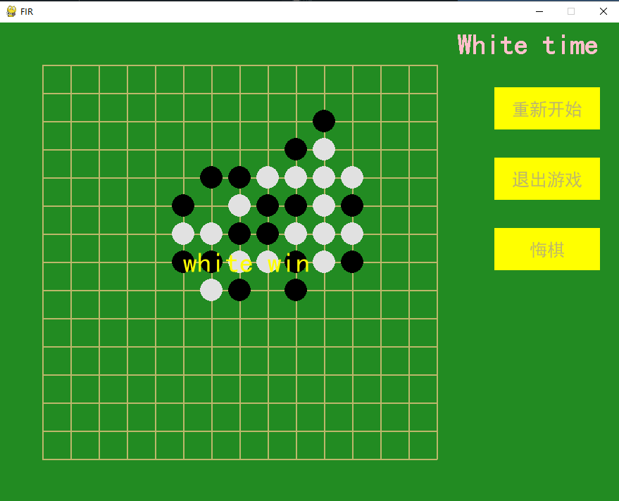
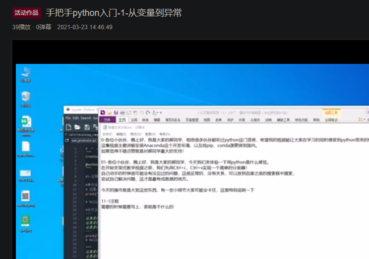

# Play-Python

> 简单的python入门内容，前面四个文件夹包含python的基本操作内容，有PDF和PNG两种格式的思维导图，另一个需要用Mindmaster打开，最后一个文件夹里面有一个简单的**五子棋游戏**，可以拿来修改修改练练手。
甚至可以修改成六子棋~

目录：

[0-Anaconda环境安装](https://github.com/Deng-deng-deng-deng/Play-Python/tree/main/0-%E5%AE%89%E8%A3%85Anaconda%E7%8E%AF%E5%A2%83)

[1-1-从变量到异常](https://github.com/Deng-deng-deng-deng/Play-Python/tree/main/1-%E4%BB%8E%E5%8F%98%E9%87%8F%E5%88%B0%E5%BC%82%E5%B8%B8)

[2-数据结构汇总](https://github.com/Deng-deng-deng-deng/Play-Python/tree/main/2-%E6%95%B0%E6%8D%AE%E7%BB%93%E6%9E%84%E6%B1%87%E6%80%BB)

[3-从函数到方法](https://github.com/Deng-deng-deng-deng/Play-Python/tree/main/3-%E4%BB%8E%E5%87%BD%E6%95%B0%E5%88%B0%E6%96%B9%E6%B3%95)

[last-五子棋](https://github.com/Deng-deng-deng-deng/Play-Python/tree/main/last-%E4%BA%94%E5%AD%90%E6%A3%8B%E5%B0%8F%E6%B8%B8%E6%88%8F)

视频：

[简单的视频讲解](https://www.bilibili.com/video/BV1qV411e75f/)

